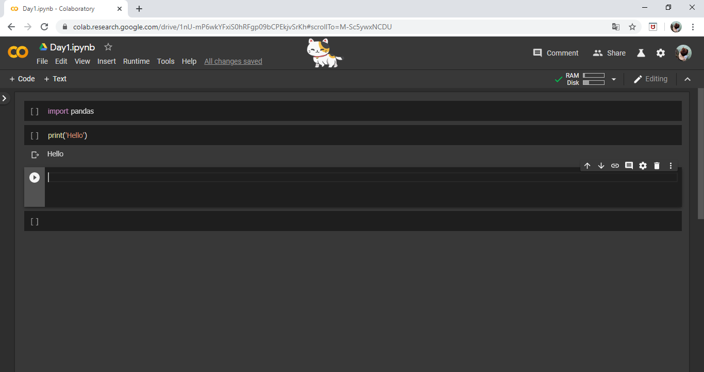
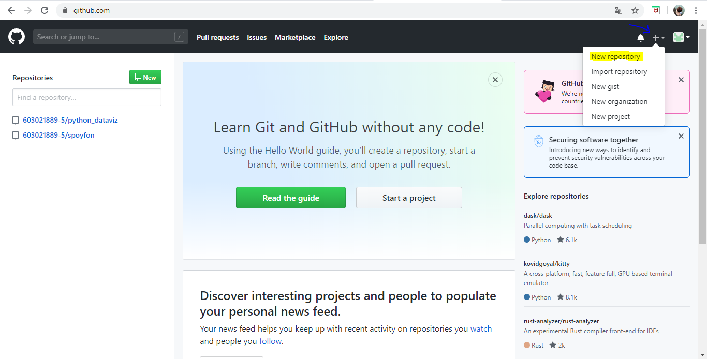

# python_dataviz
## นางสาวโสภิตา  แสงขาว 
## 603021889-5 

## การติดตั้งโปรแกรม Miniconda
1.ทำการค้นหาคำว่า "Miniconda" เพื่อทำการดาน์โหลดลงเครื่อง

2.ทำการกดเข้าไปที่เว็บไซต์ดังกล่าว >>> [Click here](https://docs.conda.io/en/latest/miniconda.html)         จากนั้นจะปรากฎหน้าเว็บไซต์ขึ้นให้ดาวน์โหลด

3.หน้าเว็บจะปรากฏเวอร์ชั่นต่างๆให้ดาวน์โหลด สามารถเลือกดาวน์โหลดได้ตามความเหมาะสมตามเวอร์ชั่นคอมพิวเตอร์ (ทั้งนี้เราเลือกดาวน์โหลดเวอร์ชั่น3.7)

4.เมื่อกดดาวน์โหลดเวอร์ชั่นที่ต้องการเสร็จเรียบร้อยแล้ว ตัวโปรแกรมจะแสดงหน้าต่างเพื่อให้เรา install ลงเครื่อง(กดติดตั้งตามลูกศร)

5.เมื่อทำการติดตั้งเรียบร้อยแล้วเปิดโปรแกรมขึ้นมา พร้อมเลือกโฟล์เดอร์ที่เราต้องการจะเก็บข้อมูลไว้โดยทำการพิมพ์คำว่า "cd" ตามด้วยชื่อโฟล์เดอร์ (ตัวอย่างตามภาพ สามารถคัดลอกชื่อโฟล์เดอร์มาวางได้เลย)

 

6.จากนั้นทำการติดตั้งแพคเกจต่างๆที่จำเป็นต้องใช้ในการทำงาน โดยใช้คำสั่งคือ conda install ตามด้วยชื่อแพคเกจ (ตัวอย่างตามภาพ)

 

7.เมื่อทำการติดตั้งแพคเกจเสร็จเรียบร้อยแลล้วเราสามารถเช็คอพคเกจทั้งหมดที่เราติดตั้งเรียบร้อยแล้วด้วยคำสั่ง pip freeze

8.จากนั้นทำการเรียกใช้งาน jupyter ด้วยคำสั่ง jupyter notebook

9.เมื่อทำการเรียกใช้งานเสร็จเรียบร้อยแล้วโปรแกรมจะรันคำสั่งและแสดงหน้าการใช้งาน jupyter ทันที และสามารถใช้งานได้ตามปกติ

# การใช้งาน Google colab
1.ทำการค้นหาโดยพิมพ์คำว่า "Google colab" (จะปรากฏหน้าการค้นหาดังภาพ)

2.ทำการเลือกไปที่เว็บไซต์ดังกล่าว >>> [Click here](https://colab.research.google.com/notebooks/welcome.ipynb)

3.เมื่อทำการกดเข้ามาแล้วจะปรากฎหน้าแรกของ Google colabให้ทำการล็อกอินด้วยอีเมลล์ของตนเอง

4.เมื่อทำการล็อคอินเสร็จเรียบร้อยแล้วจะขึ้นหน้าแอคเคาท์ของตนเองที่เชื่อมต่อกับโฟล์เดอร์ที่เราเลือกที่จะเก็บข้อมูลที่อยู่บนโปรแกรม Miniconda จึงทำให้เราเห็นไฟล์ที่ถูกเก็บอยู่ในโฟล์เดอร์นั้นด้วยทั้งนี้เราสามารถเลือกไฟล์เพื่อทำการแก้ไขหรือจะสร้างเป็นไฟล์ใหม่ก็ได้เช่นกัน

5.เมื่อเราทำการ create หรือ edit เรียบร้อยและทำการบันทึกเสร็จแล้วไฟล์นั้นก็จะถูกบันทึกลง Recent ของเราเช่นกัน

# การใช้งาน Github
1.ทำการค้นหาคำว่า "Github.com" >>> [Click here](https://github.com/)

2.เมื่อทำการค้นหาเสร็จแล้วจะปรากฏหน้าเว็บไซต์ของ Github ให้ทำการสมัคสมาชิกโดยเลือกที่คำว่า "Sign up" หากทำการสมัตรสมาชิกเรียบร้อยแล้วให้ทำการ Sign in ได้เลย

3.เมื่อทำการ Sign in เข้ามาแล้วจะพบหน้าแรกของ Github ที่เชื่อมด้วยบัญชีที่เราล็อคอินเข้าไป

4.จากนั้นเมื่อเราต้องการที่จะ create repository ของเราให้เราทำการเลือกไปที่เครื่องหมายบวกที่อยู่ด้านบนมุมขวามือแล้วเลือกคำว่า "New respository" เพื่อทำการ create respository

5.เมื่อทำการเลือกที่จะสร้างงานของเราแล้วจะปรากฏหน้าที่ให้กรอกชื่องานและรายละเอียดของงานนั้นๆพร้อมตั้งค่าให้คนอื่นสามารถเข้ามาดูผลงานของเราได้หรือไม่

6.เมื่อเราทำการกรอกรายละเอียดเสร็จเรียบร้อยแล้วให้กดไปที่คำว่า "Create repository"

7.จากนั้นเมื่อเราทำการสร้างเสร็จแล้ว งานนี้จะเข้ามาอยู่ใน respositories ของเรา

8.เมื่อทำการสร้างงานของเราเสร็จแล้วให้ทำการ clone ไฟล์ไปยัง Miniconda ด้วยการคัดลอกลิงค์ URL (ตัวอย่างตามภาพ)

9.เมื่อทำการคัดลอกลิงค์ URLเสร็จแล้วให้นำไปวางที่โปรแกรม Miniconda โดยใช้คำสั่ง git clone ตามด้วยลิงค์ URL ที่คัดลอกมาจาก github 

10.เมื่อทำการ clone เรียบร้อยแล้วให้ทำการเปิดโปรแกรม visual studio code เพื่อทำการสร้างงาน โดยใช้คำสั่ง code .

11.เมื่อทำการสร้างงานเรียบร้อยแล้วให้ทำการเช็คว่าไฟล์ไหนที่ยังไม่เชื่อมต่ออินเตอร์เน็ต โดยทำการเชื่อมโฟล์เดอร์ที่เก็บไฟล์ต่างๆมาไว้บนโปรแกรม Miniconda ด้วยคำสั่ง cd ตามด้วยชื่อโฟล์เดอร์

12.จากนั้นให้ทำการเช็คไฟล์ว่าไฟล์ไหนยังไม่เชื่อมอินเตอร์เน็ตด้วยคำสั่ง git status หากไฟล์ไหนยังไม่ได้เชื่อมจะแสดงตัวหนังสือสีแดง(ตัวอย่างตามภาพ
)

12.เมื่อพบไฟล์ที่ไม่ได้เชื่อมแล้วให้ทำการเชื่อมโดย add เข้าไปก่อน โดยใช้คำสั้ง git add แล้วตามด้วยชื่อไฟล์ที่จะแอดเข้สาไป (ตัวอย่างตามภาพ)

13.หลังจากทำการแอดเข้าไปเสร็จแล้วให้เช็คเวอร์ชั่นก่อนจะอัพโหลดลง github โดยใช้คำสั่ง git commit -m "test"

14.เมื่อทำการเช็คเวอร์ชั่นเสร็จแล้วให้ทำการอัพโหลดไปยัง github โดยใช้คำสัง git push จากนั้นโปรแกรมจะแสดงคำสั่งที่ให้กรอกชื่อ usename และรหัสผ่านของเรา **กรณีให้กรอกรหัสผ่านจะไม่แสดงตัวอักษรเวลาพิมพ์

15.เมื่อทำการอัพโหลดไปยัง github เรียบร้อยแล้วให้เข้าไปเช็คในเว็บไซต์ github อีกครั้งว่าที่ทำการอัพโหลดไปครบถ้วนสมบูรณ์หรือไม่ หากไม่ครบถ้วนให้กลับมาแก้ไขในโปรแกรม miniconda และทำการเช็คไฟล์โดยใช้คำสั่ง git statau เช่นเคย

# **เพิ่มเติม**
# การติดตั้งโปรแกรม visual เพื่อมาใช้ในการสร้างงานไปยัง github
1.ค้นหาคำว่า "visual studio code" >>> [Click here](https://code.visualstudio.com/)

2.เมื่อทำการกดเข้าไปที่เว็บไซต์ดังกล่าวจะแสดงหน้าให้ดาวน์โหลดโปรแกรม และทำกดดาวน์โหลดได้เลย

3.เมื่อทำการกดดาวน์โหลดเสร็จแล้วจะแสดงหน้าการดาวน์โหลดให้เลือกแต่ละเวอร์ชั่นที่เหมาะกับคอมพิวเตอร์

4.เมื่อทำการโหลดและติดตั้งลงบนเครื่องเรียบร้อยแล้วสามารถเรียกใช้งานโปรแกรมผ่านโปรแกรม miniconda ได้เลย

 

# คู่มือสำหรับการใช้งานใน visual studio code เพื่อใช้ในการแทรกรูปภาพหรือเว็บไซต์ต่างๆ
1.ค้นหาคำว่า "markdown cheat sheet" >>> [Click here](https://www.markdownguide.org/cheat-sheet/?fbclid=IwAR1txzi9SD3FeIPGsrcxyfAr5Iwh2vjbH9NnFfmmii9N

 

2.กดเลือกเข้าไปยังเว็บไซต์ดังกล่าว ก็จะเจอ code การใช้งานต่างๆ

 

 